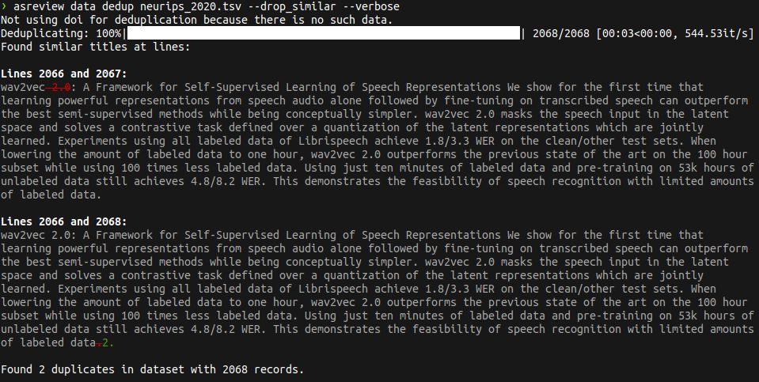

# ASReview Datatools

[](https://badge.fury.io/py/asreview-datatools) [](https://pepy.tech/project/asreview-datatools) [](https://zenodo.org/badge/latestdoi/239740436)

ASReview Datatools is an extension to [ASReview
LAB](https://github.com/asreview/asreview) that can be used to:
- [**Describe**](#data-describe) basic properties of a dataset
- [**Convert**](#data-convert) file formats
- [**Deduplicate**](#data-dedup) data
- [**Stack**](#data-vstack-experimental) multiple datasets
- [**Compose**](#data-compose-experimental) a single (labeled, partly labeled, or unlabeled) dataset from multiple datasets
- [**Snowball**](#snowball) a dataset to find incoming or outgoing citations
- [**Sample**](#sample) old, random, and new papers in order to check if the terminology has changed over time.

Several [tutorials](Tutorials.md) are available that show how
`ASReview-Datatools` can be used in different scenarios.

ASReview datatools is available for ASReview LAB version 1 or later.
If you are using ASReview LAB version 0.x, use [ASReview-statistics](https://pypi.org/project/asreview-statistics/) instead of ASReview datatools.

## Installation
ASReview Datatools requires Python 3.7+ and [ASReview LAB](https://github.com/asreview/asreview) version 1.1 or later.

The easiest way to install the extension is to install it from PyPI:

``` bash
pip install asreview-datatools
```

After installation of the datatools extension, `asreview` should automatically
detect it. Test this with the following command:

```bash
asreview --help
```

The extension is successfully installed if it lists `asreview data`.

To make sure that you are working with the latest version of datatools you can use:

```bash
pip install asreview-datatools --upgrade
```

## Getting started

ASReview Datatools is a command line tool that extends ASReview LAB. Each
subsection below describes one of the tools. The structure is

```bash
asreview data NAME_OF_TOOL
```

where `NAME_OF_TOOL` is the name of one of the tools below (`describe`, `convert`, `dedup`, `vstack`, or `compose`)
followed by positional arguments and optional arguments.

Each tool has its own help description which is available with

```bash
asreview data NAME_OF_TOOL -h
```

## Tools
### Data Describe

Describe the content of a dataset

```bash
asreview data describe MY_DATASET.csv
```

Export the results to a file (`output.json`)

```bash
asreview data describe MY_DATASET.csv -o output.json
```

Describe the `van_de_schoot_2018` dataset from the [benchmark
platform](https://github.com/asreview/systematic-review-datasets).

```bash
asreview data describe synergy:van_de_schoot_2018 -o output.json
```
```
{
  "asreviewVersion": "1.1",
  "apiVersion": "1.1.1",
  "data": {
    "items": [
      {
        "id": "n_records",
        "title": "Number of records",
        "description": "The number of records in the dataset.",
        "value": 6189
      },
      {
        "id": "n_relevant",
        "title": "Number of relevant records",
        "description": "The number of relevant records in the dataset.",
        "value": 43
      },
      {
        "id": "n_irrelevant",
        "title": "Number of irrelevant records",
        "description": "The number of irrelevant records in the dataset.",
        "value": 6146
      },
      {
        "id": "n_unlabeled",
        "title": "Number of unlabeled records",
        "description": "The number of unlabeled records in the dataset.",
        "value": 0
      },
      {
        "id": "n_missing_title",
        "title": "Number of records with missing title",
        "description": "The number of records in the dataset with missing title.",
        "value": 5
      },
      {
        "id": "n_missing_abstract",
        "title": "Number of records with missing abstract",
        "description": "The number of records in the dataset with missing abstract.",
        "value": 764
      },
      {
        "id": "n_duplicates",
        "title": "Number of duplicate records (basic algorithm)",
        "description": "The number of duplicate records in the dataset based on similar text.",
        "value": 104
      }
    ]
  }
}
```

### Data Convert

Convert the format of a dataset. For example, convert a RIS dataset into a
CSV, Excel, or TAB dataset.

```
asreview data convert MY_DATASET.ris MY_OUTPUT.csv
```

### Data Dedup

Remove duplicate records with a simple and straightforward deduplication
[algorithm](https://asreview.readthedocs.io/en/latest/generated/asreview.ASReviewData.duplicated.html#asreview.ASReviewData.duplicated). The algorithm first removes all duplicates based on a persistent
identifier (PID). Then it concatenates the title and abstract, whereafter it
removes all non-alphanumeric tokens. Then the duplicates are removed.

```
asreview data dedup MY_DATASET.ris
```

Export the deduplicated dataset to a file (`output.csv`)

```
asreview data dedup MY_DATASET.ris -o output.csv
```

By default, the PID is set to 'doi'. The `dedup` function offers the option to
use a different PID. Consider a dataset with PubMed identifiers (`PMID`), the
identifier can be used for deduplication.

```
asreview data dedup MY_DATASET.csv -o output.csv --pid PMID
```

Using the `van_de_schoot_2018` dataset from the [benchmark
platform](https://github.com/asreview/systematic-review-datasets).

```bash
asreview data dedup synergy:van_de_schoot_2018 -o van_de_schoot_2018_dedup.csv
```
```
Removed 104 records from dataset with 6189 records.
```

We can also choose to deduplicate based on the similarity of the title and abstract, instead of checking for an exact match. This way we can find duplicates that have small differences, but are actually the same record (for example, an additional comma or a fixed typo). This can be done by using the `--drop_similar` flag. This process takes about 4s on a dataset of about 2068 entries.

```bash
asreview data dedup neurips_2020.tsv --drop_similar
```
```
Not using doi for deduplication because there is no such data.
Deduplicating: 100%|████████████████████████████████████| 2068/2068 [00:03<00:00, 531.93it/s]
Found 2 duplicates in dataset with 2068 records.
```

If we want to check which entries were found as duplicates, we can use the `--verbose` flag. This will print the lines of the dataset that were found as duplicates, as well as the difference between them. Any text that has to be removed from the first entry to become the second one is shown as red and has a strikethrough, and any text that has to be added to the first entry is shown as green. All text that is the same in both entries is dimmed.

```bash
asreview data dedup neurips_2020.tsv --drop_similar --verbose
```



The similarity threshold can be set with the `--similarity` flag. The default similarity threshold is `0.98`. We can also choose to only use the title for deduplication by using the `--skip_abstract` flag.

```bash
asreview data dedup neurips_2020.tsv --drop_similar --similarity 0.98 --skip_abstract
```
```
Not using doi for deduplication because there is no such data.
Deduplicating: 100%|████████████████████████████████████| 2068/2068 [00:02<00:00, 770.74it/s]
Found 4 duplicates in dataset with 2068 records.
```

Note that you might have to adjust your similarity score if you choose to only use the title for deduplication. The similarity score is calculated using the [SequenceMatcher](https://docs.python.org/3/library/difflib.html#difflib.SequenceMatcher) class from the `difflib` package. The similarity score is calculated as the ratio of the number of matching characters to the total number of characters in the two strings. For example, the similarity score between the strings "hello" and "hello world" is 0.625. By default, we use the [real_quick_ratio](https://docs.python.org/3/library/difflib.html#difflib.SequenceMatcher.real_quick_ratio) and [quick_ratio](https://docs.python.org/3/library/difflib.html#difflib.SequenceMatcher.quick_ratio) methods, which are faster and usually good enough, but less accurate. If you want to use the ratio method, you can use the `--strict_similarity` flag.

Now, if we want to discard stopwords for deduplication (for a more strict check on the important words), we can use the `--discard_stopwords` flag. The default language for the stopwords is `english`, but that can be set with the `--stopwords_language` flag. The list of supported languages for the stopwords are the same supported by the [nltk](https://www.nltk.org/index.html) package. To check the list of available languages, you can run the following commands on your python environment:

```python
from nltk.corpus import stopwords
print(stopwords.fileids())
```
```
['arabic', 'azerbaijani', 'basque', 'bengali', 'catalan', 'chinese', 'danish', 'dutch', 'english', 'finnish', 'french', 'german', 'greek', 'hebrew', 'hinglish', 'hungarian', 'indonesian', 'italian', 'kazakh', 'nepali', 'norwegian', 'portuguese', 'romanian', 'russian', 'slovene', 'spanish', 'swedish', 'tajik', 'turkish']
```

### Data Vstack (Experimental)

Vertical stacking: combine as many datasets in the same file format as you want into a single dataset.

❗ Vstack is an experimental feature. We would love to hear your feedback.
Please keep in mind that this feature can change in the future.

Stack several datasets on top of each other:
```
asreview data vstack output.csv MY_DATASET_1.csv MY_DATASET_2.csv MY_DATASET_3.csv
```
Here, three datasets are exported into a single dataset `output.csv`.
The output path can be followed by any number of datasets to be stacked.

 This is an example using the [demo datasets](https://github.com/asreview/asreview-datatools/tree/master/tests/demo_data):

```bash
asreview data vstack output.ris dataset_1.ris dataset_2.ris
```


### Data Compose (Experimental)

Compose is where datasets containing records with different labels (or no
labels) can be assembled into a single dataset.

❗ Compose is an experimental feature. We would love to hear your feedback.
Please keep in mind that this feature can change in the future.

Overview of possible input files and corresponding properties, use at least
one of the following arguments:

| Arguments            | Action                                     |
|----------------------|--------------------------------------------|
| `--relevant`, `-r`   | Label all records from this dataset as `relevant` in the composed dataset.   |
| `--irrelevant`, `-i` | Label all records from this dataset as `irrelevant` in the composed dataset. |
| `--labeled`, `-l`    | Use existing labels from this dataset in the composed dataset.           |
| `--unlabeled`, `-u`  | Remove all labels from this dataset in the composed dataset.              |

The output path should always be specified.

Duplicate checking is based on title/abstract and a persistent identifier
(PID) like the digital object identifier (DOI). By default, `doi` is used as
PID. It is possible to use the flag `--pid`  to specify a persistent
identifier other than `doi`. In case duplicate records are detected, the user
is warned, and the conflicting records are shown. To specify what happens in
case of conflicts, use the `--conflict_resolve`/`-c` flag. This is set to
`keep_one` by default, options are:

| Resolve method | Action in case of conflict                                                              |
|----------------|-----------------------------------------------------------------------------------------|
| `keep_one`     | Keep one label, using `--hierarchy` to determine which label to keep                    |
| `keep_all`     | Keep conflicting records as duplicates in the composed dataset (ignoring `--hierarchy`) |
| `abort`        | Abort                                                                                   |


In case of an ambiguously labeled record (e.g., one record with two different
labels), use `--hierarchy` to specify a hierarchy of labels. Pass the letters
`r` (relevant), `i` (irrelevant), and `u` (unlabeled) in any order to set
label hierarchy. By default, the order is `riu`  meaning that relevant labels
are prioritized over irrelevant and unlabeled, and irrelevant labels are
prioritized over unlabeled ones.


Asume you have records in `MY_DATASET_1.ris` from which you want to keep all
existing labels and records in `MY_DATASET_2.ris` which you want to keep
unlabeled. Both datasets can be composed into a single dataset using:

```bash
asreview data compose composed_output.ris -l DATASET_1.ris -u DATASET_2.ris --hierarchy uir -c abort
```
Because of the flag `-c abort` in case of conflicting/contradictory labels,
the user is warned, records with inconsistent labels are shown, and the script
is aborted. The flag `--hierarchy uir` results in the following hierarch if any
duplicate ambiguously labeled records exist: unlabeled is prioritized over
irrelevant and relevant labels, and irrelevant labels are prioritized over
relevant labels.

## Snowball

ASReview Datatools supports snowballing via the `asreview data snowball` subcommand.
It can perform both backwards (outgoing citations) and forwards (incoming citations)
snowballing. The tool works by searching the [OpenAlex](https://openalex.org/) database
for citation data. An example usage would be:

```bash
asreview data snowball input_dataset.csv output_dataset.csv --forward
```

This performs forwards snowballing on `input_dataset.csv` and writes the results to
`output_dataset.csv`. For this to work it is necessary that the input dataset contains
a column with DOI's or a column called `openalex_id` containing OpenAlex work
identifiers. The output dataset will contain the columns `id`, `doi`, `title`, `abstract`, `referenced_works` and `publication_date`. In the case of forward snowballing it will
contain all works in OpenAlex that have a reference to one of the included works in the
input dataset. In the case of backward snowballing it will contain all works in OpenAlex
with referenced by one of the included works of the input dataset.

If you want to find references for all records in your dataset, instead of just the included works, you can include the flag `--all`, so for example:

```bash
asreview data snowball input_dataset.csv output_dataset.csv --backward --all
```

One thing to note is that OpenAlex will handle data requests faster if the sender sends along their email with the request (see [OpenAlex Polite Pool](https://docs.openalex.org/how-to-use-the-api/rate-limits-and-authentication#the-polite-pool
)), you can to this using the `--email` argument. An example would be:

```bash
asreview data snowball input_dataset.csv output_dataset.csv --backward --email my_email@provider.com
```

## Sample

This datatool is used to sample old, random and new records from your dataset by using the `asreview data sample` command. The sampled records are then stored in an output file. This can be useful for detecting concept drift, meaning that the words used for certain concepts change over time. This script assumes that the dataset includes a column named `publication_year`. An example would be:

```bash
asreview data sample input_dataset.xlsx output_dataset.xlsx 50
```
This samples the `50` oldest and `50` newest records from `input_dataset.xlsx` and samples `50` records randomly (without overlap from the old and new partitions!). The resulting 150 records are written to `output_dataset.xlsx`.

## License

This extension is published under the [MIT license](/LICENSE).

## Contact

This extension is part of the ASReview project ([asreview.ai](https://asreview.ai)). It is maintained by the
maintainers of ASReview LAB. See [ASReview
LAB](https://github.com/asreview/asreview) for contact information and more
resources.
